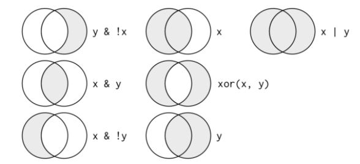

```{r setup, include=FALSE}
knitr::opts_chunk$set(echo = TRUE)
```

### Data Transformation
At this point in the class, you should:

  * Have run some of the R code I've provided and what's in the textbook
  * Played around a little with the ggplot functions to generate your own variations of the graphs you've seen so far
  * Conducted your own analysis in Excel for Lab 1

This is a pretty good list of experiences for a brand new data analyst. You have a working knowledge sufficient to take clean, pre-formatted data and derive your own insights from its contents with visualizations. The next topic in the class, **data transformation**, will take your budding analytics skillset and broaden its applicability. Up to this point (in R, at least), you've been given the data exactly as you need it to generate a graph. Once you are able to transform data sets, you will be able to generate whatever graph you need, given clean data. 

Use the link below to read about the source data. 

[Source Data](https://github.com/rfordatascience/tidytuesday/blob/master/data/2020/2020-03-10/readme.md)

The five verbs of dplyr. 

  1. filter()
  2. arrange()
  3. select()
  4. mutate()
  5. summarise()

All verbs work similarly:

  1. The first argument is a data frame.
  2. The subsequent arguments describe what to do with the data frame, using the variable names (without quotes).
  3. The result is a new data frame.
  
Let's start with filtering. 

```{r, warning=F, message=F, cache=TRUE}
# Get the Data

tuition_cost <- readr::read_csv('https://raw.githubusercontent.com/rfordatascience/tidytuesday/master/data/2020/2020-03-10/tuition_cost.csv')

tuition_income <- readr::read_csv('https://raw.githubusercontent.com/rfordatascience/tidytuesday/master/data/2020/2020-03-10/tuition_income.csv') 

salary_potential <- readr::read_csv('https://raw.githubusercontent.com/rfordatascience/tidytuesday/master/data/2020/2020-03-10/salary_potential.csv')

historical_tuition <- readr::read_csv('https://raw.githubusercontent.com/rfordatascience/tidytuesday/master/data/2020/2020-03-10/historical_tuition.csv')

diversity_school <- readr::read_csv('https://raw.githubusercontent.com/rfordatascience/tidytuesday/master/data/2020/2020-03-10/diversity_school.csv')

# Or read in with tidytuesdayR package (https://github.com/thebioengineer/tidytuesdayR)
# PLEASE NOTE TO USE 2020 DATA YOU NEED TO USE tidytuesdayR version ? from GitHub

# Either ISO-8601 date or year/week works!

# Install via devtools::install_github("thebioengineer/tidytuesdayR")

# tuesdata <- tidytuesdayR::tt_load('2020-03-10')
# tuesdata <- tidytuesdayR::tt_load(2020, week = 11)


# tuition_cost <- tuesdata$tuition_cost
```

Gather your initial impressions of the data by viewing it in RStudio windows and reading the data set descriptions in the README page on github.

A lesson on filtering is really a lesson on operators. Since filtering is selecting certain rows based on their values, we need to know how to write our criteria for the values we want and don't want. 

Logical Operators

  - `&`
  - `|`
  - `!`
  
Numerical Operators
  
  - `>`
  - `>=`
  - `<`
  - `<=`
  - `!=` 
  - `==`




```{r, message=F, warning=F}
library(dplyr)
t1 <- tuition_income %>% filter(income_lvl=='30,001 to 48,000', year == 2018)


```


